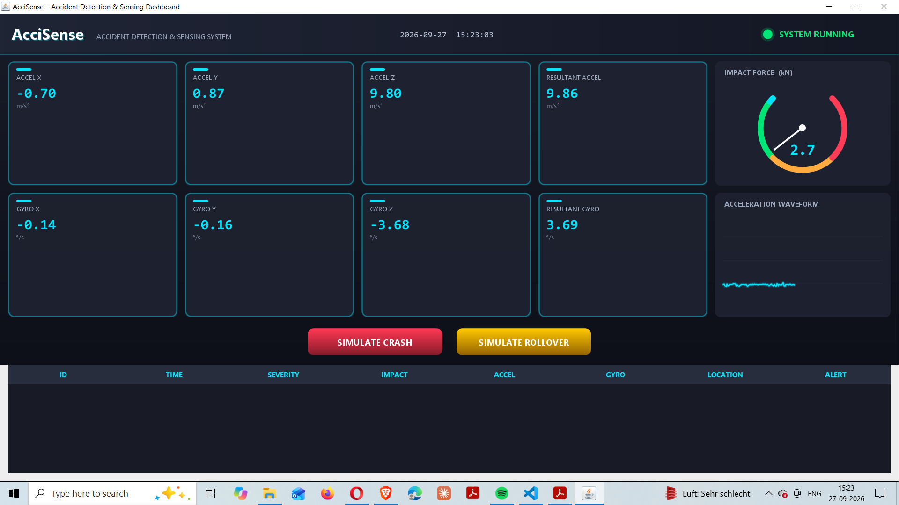
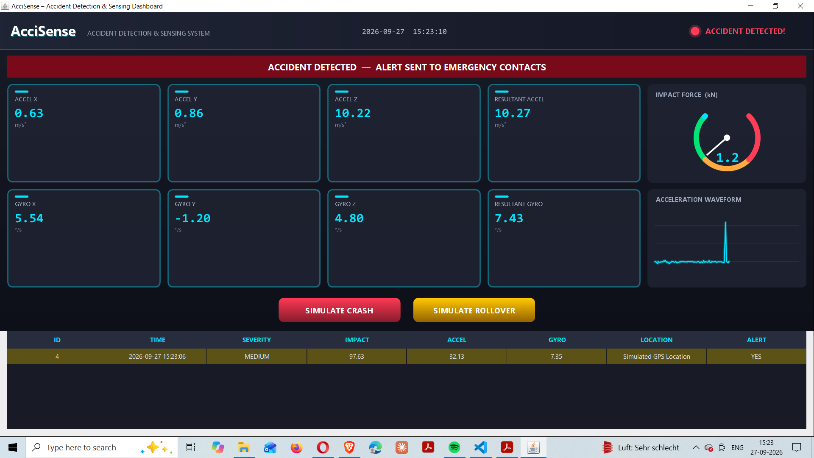
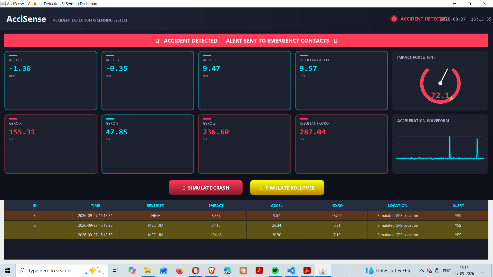

# AcciSense - Accident Detection & Sensing System

A real-time accident detection system built in pure Java (Swing GUI + SQLite + JDBC).

## Screenshots

## Features
- Real-time sensor simulation (Accelerometer, Gyroscope, Impact)
- Threshold-based accident detection (2-of-3 trigger confirmation)
- Severity classification: LOW / MEDIUM / HIGH / CRITICAL
- Sound alert (Java Sound API) + SMS simulation
- SQLite storage via JDBC (PreparedStatement, ResultSet, CRUD)
- Animated Swing dashboard: glowing cards, impact gauge, live waveform, flashing alerts

## OOP Concepts (Rubric Coverage)
| Concept | Where |
|---|---|
| Inheritance | BaseSensor -> AccelerometerSensor / GyroscopeSensor / ImpactSensor |
| Polymorphism | read() / readAll() overridden, runtime dispatch |
| Interfaces | SensorListener, AccidentListener, AlertListener |
| Exception Handling | SensorException, DatabaseException, try-catch |
| Collections & Generics | ArrayList, HashMap, ConcurrentLinkedQueue, Comparable |
| Multithreading & Synchronization | Runnable sensor thread, synchronized blocks, SwingUtilities.invokeLater |
| JDBC | DriverManager, PreparedStatement, ResultSet, DatabaseManager CRUD |

## Project Structure
- src/com/accisense/main - AcciSenseApp.java (entry point, wiring)
- src/com/accisense/model - SensorData, AccidentRecord
- src/com/accisense/sensor - BaseSensor + 3 sensors + SensorSimulator
- src/com/accisense/detection - AccidentDetector
- src/com/accisense/alert - AlertManager
- src/com/accisense/exception - SensorException, DatabaseException
- src/com/accisense/storage - DatabaseManager (JDBC)
- src/com/accisense/gui - Dashboard (animated Swing UI)

## Requirements
- JDK 17+
- JARs in lib/ (sqlite-jdbc, slf4j-api, slf4j-nop) - already included in repo

## How to Run
1. Compile:
   javac -cp "lib/*" -d out src/com/accisense/*/*.java
2. Run (Windows):
   java -cp "out;lib/*" com.accisense.main.AcciSenseApp
   (Linux/Mac: use : instead of ; in classpath)
3. Click SIMULATE CRASH / SIMULATE ROLLOVER to test detection.
